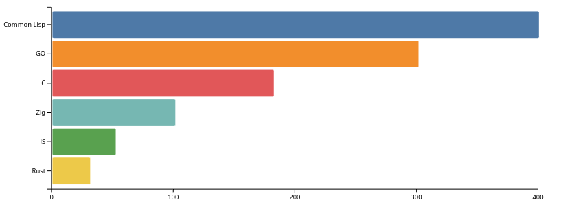
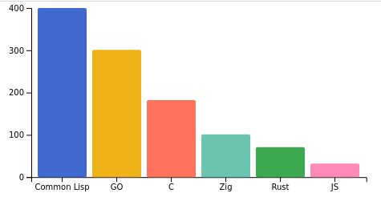
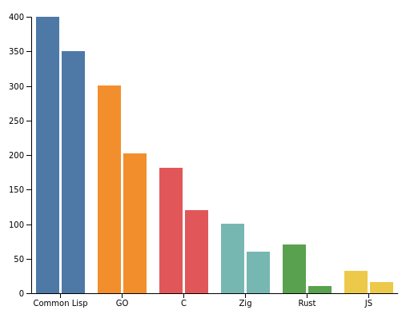

# D3-Eazy

_*THIS SOFTWARE IS ALPHA QUALITY*_

_*EXPECT THE API TO CHANGE*_

Wrapper around D3 charts using the general update pattern.

This library attempts to insulate the user from the complexities of the D3 library while still making the D3 API accessible with much of the power available and a few extras on top.

The General Update Pattern allows the user to change the charts in real-time and create beautiful, dynamic charts easily.

A simple bar chart can be created like this:

```javascript
var el = "barChartSimpleOne";
var dataset = [
  { name: "JS", value: 32, nice: 16 },
  { name: "GO", value: 301, nice: 202 },
  { name: "C", value: 182, nice: 120 },
  { name: "Rust", value: 71, nice: 10 },
  { name: "Zig", value: 101, nice: 60 },
  { name: "Common Lisp", value: 400, nice: 350 },
];
//
const rect = document.getElementById(el).getBoundingClientRect();
const width = rect.width;
const height = rect.height;
//
var max = d3.max(dataset, (d) => d.value);
var domain = d3.sort(dataset, (d) => -d.value).map((d) => d.name);
//
var TheBar = BarChartSimple()
  .SvgID("thebar")
  .Val(function (a) {
    return a.value;
  })
  .Band(function (a) {
    return a.name;
  })
  .Orient("vertical")
  .DomainBand(domain)
  .DomainVal([0, max])
  .ColourDomain(domain)
  .ColourRange(d3.schemeObservable10)
  .Width(width)
  .Height(height)
  .MarginTop(0)
  .MarginBottom(0)
  .MarginLeft(80)
  .MarginRight(0)
  .CornerRadiusX(2)
  .Data(dataset);
//
d3.select("#" + el).call(TheBar);
```

Creating this chart:



One change to the chained functions (Orient("horizontal")) will produce this chart:



## Charts

Line:

[Line Chart](docs/imgs/sparkBeta.png)

Grouped Bar Chart:



## Credits

Mike Bostock for [D3 Reusable Charts](https://bost.ocks.org/mike/chart/).

Rob Moore at Toptal for [Updatable Charts](https://www.toptal.com/d3-js/towards-reusable-d3-js-charts).

## Prior Art

[D3-ez](https://github.com/jamesleesaunders/d3-ez)

@jamesleesaunders use of events and generalising the data format functions have been very useful examples.

[D3-Timeseries](https://github.com/mcaule/d3-timeseries)

@mcaule
