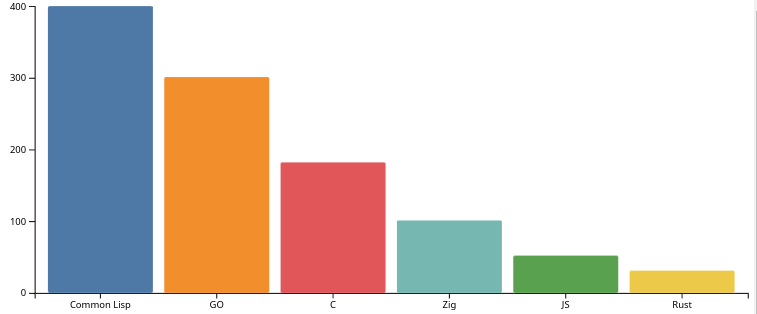

# D3-Eazy

TODO actually make it useful as a library.

Wrapper around D3 charts using the general update pattern.

Many thanks to Rob Moore at Toptal for his [Updatable Charts](https://www.toptal.com/d3-js/towards-reusable-d3-js-charts) article.

Using the library is pretty simple.

A simple bar chart can be created like this:

```javascript
  var el = "barChartSimpleOne";
  var dataset = [
    {key:'JS',value:32},
    {key:'GO',value:301},
    {key:'Rust',value:71},
    {key:'C',value:182},
    {key:'Zig',value:101},
    {key:'Common Lisp',value:400},
  ];
  //
  const rect = document.getElementById(el).getBoundingClientRect();
  const width = rect.width;
  const height = rect.height;
  //
  var max = d3.max(dataset, d => d.value);
  var domain = d3.sort(dataset, d=> -d.value).map(d => d.key);
  //
  var TheBar = BarChartSimple()
  .SvgID("thebar")
  .Val(function(a) {return a.value;})
  .Band(function(a) {return a.key;})
  .Orient("vertical")
  .DomainBand(domain)
  .DomainVal([0,max])
  .ColourDomain(domain)
  .ColourRange(d3.schemeObservable10)
  .Width(width)
  .Height(height)
  .MarginTop(0)
  .MarginBottom(0)
  .MarginLeft(80)
  .MarginRight(0)
  .WithText(true)
  .FontDividend(2)
  .TextDeltaX(3)
  .TextDeltaY(4)
  .TextFill(["black","black"])
  .TextAnchor(["start", "end"])
  .CornerRadiusX(2)
  .Data(dataset);
  //
  d3.select("#"+el)
    .call(TheBar);
```

Creating this chart:


One change to the chained functions (Orient("horizontal")) will produce this chart:


